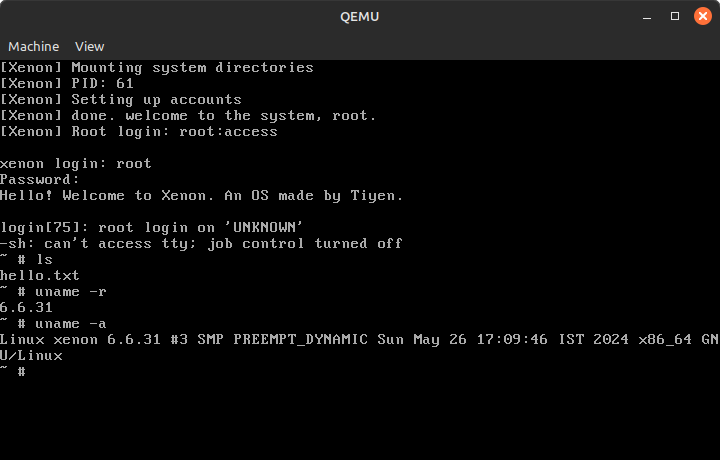

# Xenon
Toy linux distro (formerly bungalow linux)
## Screenshot

## Requirements
- tar2sqfs
- cpio (for Initramfs)
- QEMU (testing only)
## How to build
- First you need to build the bzImage/Image.gz of the Linux kernel and a statically linked busybox.
- Linux kernel needs to support overlayfs (Required only if you want to use the repo's initramfs to boot Xenon)
- Then in the repository create a dir named `bins`
- Then do:
```sh
mv path/to/kernel ./bins/linux_kernel
mv path/to/busybox ./bins/busybox
# Build:
./irf_sfs_maker.sh
```
## Running
```sh
./run
```

## Initramfs and OS squashfs
- Initramfs: This repo includes an initramfs that boots the Xenon sfs on memory, it expects the Xenon sfs to stay on `/dev/sda`, however this is only for testing and not needed for Xenon. It requires the Linux kernel to support `overlayfs`
- Xenon sfs: This is the actual operating system image. The init script is located at `/init` in the sfs, and you can create ur own initramfs to boot it

## Contribution
- Reporting a bug --> Issues
- Bugfix/Feature --> Pull request

## Roadmap
- ARM64 support
